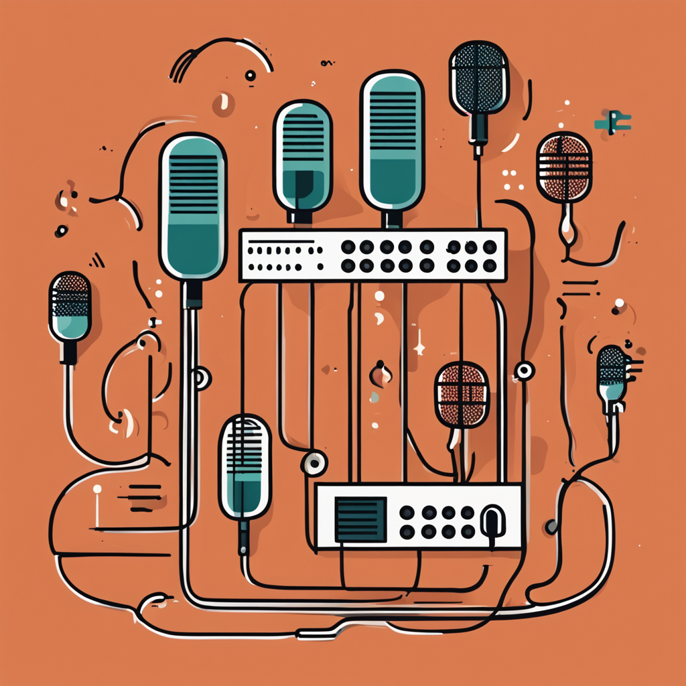

    preview do podcast

    <audio src="output/podcast_audio.mp3" controls title="Podcast"></audio>

# Projeto Podcast Gerado por I.A.s

 > ℹ️ **NOTE:** Este é o repositório desenvolvido durante uma live no Youtube em parceria com a [DIO](https://dio.me)

Projeto com o objetivo de gerar um podcast utilizando ferramentas de IA através de prompts mais trabalhado.

Utilizer uma esteira de prompts para gerar cada etapa do processo criativo.

## 💻 Tecnologias utilizadas no projeto

- [Adapta](https://www.adapta.org/) 
- [ElevenLabs](https://beta.elevenlabs.io/)

## ✨ Como foi feito ?

- Roteiro e capa gerado via Adapta (ChatGPT e Stable Diffusion)
- Audio gerado pela elevenLabs
